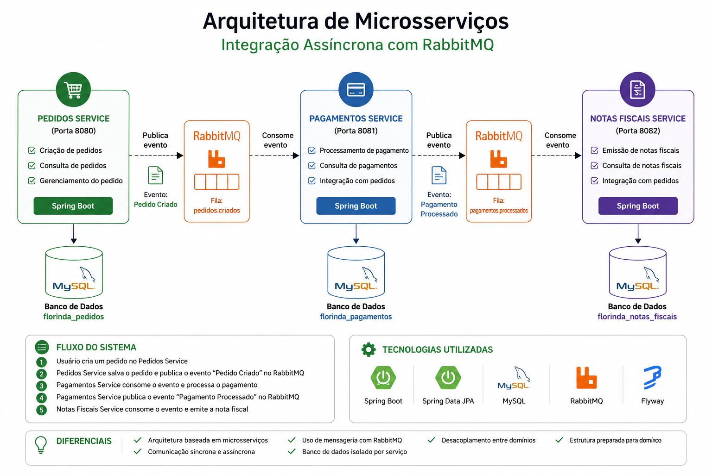

# 🐇 Arquitetura de Microsserviços com RabbitMQ (Integração Assíncrona)

Projeto que demonstra integração entre microserviços utilizando comunicação síncrona (REST) e assíncrona (RabbitMQ), simulando um fluxo real de negócio com foco em desacoplamento, escalabilidade e resiliência.


---

## 📊 Arquitetura do Sistema



A aplicação é composta por **3 microserviços independentes**, cada um com responsabilidade de domínio e banco de dados próprio.

### 🔹 Serviços

- **Pedidos (8080)**  
  Responsável pela criação e consulta de pedidos

- **Pagamentos (8081)**  
  Processamento de pagamentos vinculados aos pedidos

- **Notas Fiscais (8082)**  
  Emissão e registro de notas fiscais a partir de eventos

---

## 🔄 Comunicação

- **Síncrona (REST):**
    - Consultas entre serviços
    - Recuperação de dados

- **Assíncrona (RabbitMQ):**
    - Processamento de eventos
    - Desacoplamento entre serviços
    - Comunicação resiliente

---

## 🚀 Tecnologias

- Java 17
- Spring Boot
- Spring Data JPA / Hibernate
- Flyway (migração de banco)
- MySQL
- RabbitMQ
- Maven

---

## 📦 Estrutura dos Módulos

### 📌 pedidos

- API REST para gestão de pedidos
- Banco: `florinda_pedidos`
- Main: `PedidosApplication`

---

### 💳 pagamentos

- Processamento de pagamentos
- Integração com pedidos
- Banco: `florinda_pagamentos`
- Main: `PagamentosApplication`

---

### 🧾 notas-fiscais

- Emissão de notas fiscais baseada em eventos
- Consumo de APIs e mensageria
- Main: `NotasFiscaisApplication`

---

## ⚙️ Como executar o projeto

### 📌 Pré-requisitos

- JDK 17
- Maven
- MySQL
- RabbitMQ

---

### 📌 1. Subir infraestrutura

- Iniciar MySQL
- Iniciar RabbitMQ

---

### 📌 2. Executar os serviços

```bash
# Dentro de cada módulo
mvn clean spring-boot:run -DskipTests
```
### 📌 Endpoints

- Pedidos → http://localhost:8080
- Pagamentos → http://localhost:8081
- Notas fiscais → http://localhost:8082

### 📬 Testes com Postman

O projeto possui collections para simular os fluxos:

### 🔹 Pedidos
- Criar pedido
- Consultar pedido

### 🔹 Pagamentos
- Processar pagamento
- Consultar status

### 🔹 Notas Fiscais
- Emissão baseada em eventos
- Integração com pedidos

## 🔥 Fluxo do Sistema

1. Criar pedido (Pedidos)
2. Processar pagamento (Pagamentos)
3. Emitir nota fiscal (Notas Fiscais)
4. Comunicação via eventos (RabbitMQ)

## 📌 Diferenciais do Projeto

- [x] Arquitetura baseada em microsserviços
- [x] Comunicação síncrona e assíncrona
- [x] Uso de mensageria com RabbitMQ
- [x] Banco de dados isolado por serviço
- [x] Desacoplamento entre domínios
- [x] Estrutura preparada para escalabilidade

## 👩‍💻 Autora

Jacqueline Casali

🔗 GitHub: https://github.com/JacquelineCasali

🔗 Portfólio: https://casali.vercel.app

🔗 LinkedIn: https://www.linkedin.com/in/jaquelinecasali/